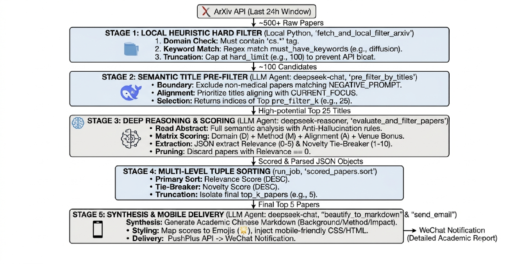

# Arxiv-Daily-Insight 🚀

> **📢 [Latest Release v2.0.0] The Intelligent Funnel Update!**
> We've completely overhauled the architecture to a Multi-Stage Filtering Funnel, saving LLM costs and eliminating hallucinations. 
> 👉 **[Read the full v2.0.0 Changelog here](./CHANGELOG.md)**

Arxiv-Daily-Insight is a professional automated pipeline...


[](https://www.python.org/downloads/)
[](https://opensource.org/licenses/MIT)
[](https://platform.openai.com/)

**Arxiv-Daily-Insight** is a professional automated pipeline designed for researchers to stay ahead of the curve. It intelligently tracks, filters, and analyzes daily arXiv submissions using advanced LLM reasoning (like DeepSeek-R1 or GPT-4o).

Stop drowning in hundreds of new papers every day. Let AI find the "Core Readings" for you.

---

## 🏗️ Technical Architecture

<p align="center">
  
</p>

1.  **Crawler**: Exhausts the 24-hour arXiv CS domain via Open API.
2.  **Funnel**: Implements a local-to-global filtering strategy to minimize LLM costs while maximizing recall.
3.  **Reasoner**: Extracts core insights from abstracts and maps relevance to semantic emojis.
4.  **Dispatcher**: Renders a mobile-optimized HTML card and pushes it to your device.

---

## 🚀 Quick Start

Get your automated academic pipeline running in under 5 minutes.

### 1. Installation
Clone the repository and install the required dependencies:
```bash
git clone [https://github.com/YourUsername/Arxiv-Daily-Insight.git](https://github.com/YourUsername/Arxiv-Daily-Insight.git)
cd Arxiv-Daily-Insight
pip install -r requirements.txt
```

### 2. Obtain Credentials
To power the LLM reasoning and mobile notifications, you will need two tokens:
- **LLM API Key**: Register at [DeepSeek Platform](https://platform.deepseek.com/) (or any OpenAI-compatible provider) to generate your API key.
- **PushPlus Token**: Visit [PushPlus](https://www.pushplus.plus/) (WeChat Notification Service), log in with WeChat, and copy your unique routing token.

### 3. Configuration & Personalization
Open `config.yaml` to inject your credentials and tailor the AI's focus to your specific research niche.

```yaml
auth:
  llm_api_key: "sk-your-api-key-here"
  pushplus_token: "your-pushplus-token-here"

criteria:
  # Crucial: Describe your specific research problem here! 
  # The LLM will use this to uncover highly relevant "hidden gems".
  current_focus: "e.g., Semi-supervised medical domain generalization..."
```
> **💡 Pro Tip:** You can also tweak `hard_limit` and `top_k_papers` in the config to balance your API costs and daily reading volume.

### 4. Manual Test Run
Before automating, verify your configuration by running the pipeline manually:
```bash
python caller.py
```
*(Check your WeChat to see if the beautiful Markdown report arrives!)*

### 5. Server Deployment (Headless Automation)
To receive daily digests automatically without keeping an SSH session alive, deploy the script as a **Cron Job** on your Linux server.

**Step 5a: Identify your Python Path**
If you are using Conda or a virtual environment, you must use the absolute path of your Python interpreter:
```bash
conda activate your_env_name
which python
# Output example: /home/user/anaconda3/envs/myenv/bin/python
```

**Step 5b: Set up the Cron Job**
Open your crontab editor (`crontab -e`) and append the following line to run the pipeline every night at 23:00. 
*(Ensure you replace the placeholders with your actual absolute paths)*:
```bash
00 23 * * * cd /path/to/Arxiv-Daily-Insight && /path/to/your/env/bin/python caller.py >> /path/to/Arxiv-Daily-Insight/cron.log 2>&1
```

🎉 **That's it! Your server will now handle the fetching, reasoning, and pushing autonomously every day.**

---

## 📊 Sample Output
The report delivered to your WeChat includes:
-   🌟 **Core Reading**: Perfect alignment with your research.
-   🔥 **Top Interest**: Highly relevant to your field.
-   💡 **Deep Analysis**: Structured insights (Background, Problem, Method, Impact).

---

## 📝 License
Distributed under the MIT License. See `LICENSE` for more information.

---
**Developed by Hongyu Zhang** *Empowering researchers with AI-driven knowledge discovery.*
📧 Contact: [zhanghongyu22@mails.jlu.edu.cn](mailto:zhanghongyu22@mails.jlu.edu.cn)
